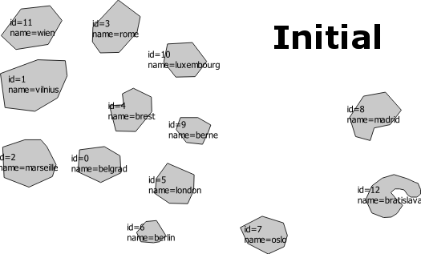
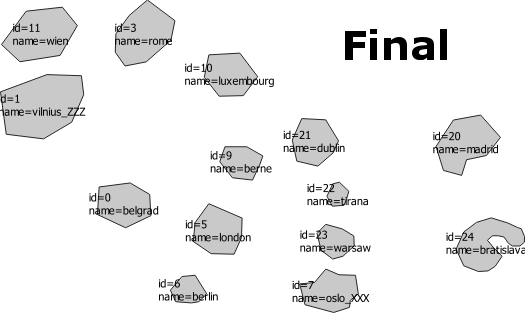
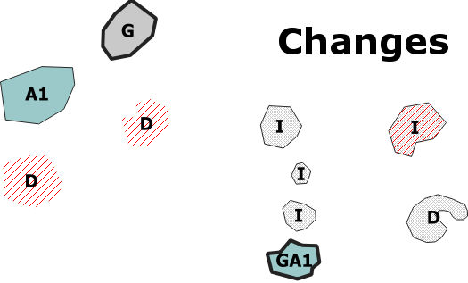
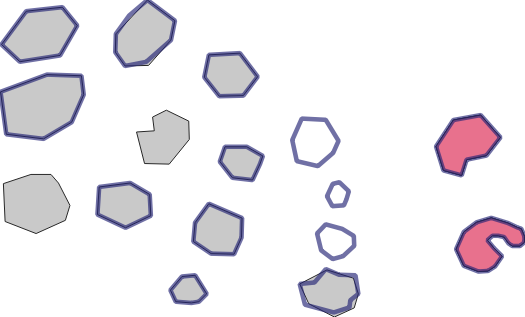

# Change detection

To analyse the changes between two versions of a datasets, use:

```java
ChangeDetection cd = new ChangeDetection(featuresIni, featuresFin);
```

where `featuresIni` and `featuresFin` are the two datasets to compare, in the initial and final versions. This input data can be loaded, for example, from a [GeoPackage](https://www.geopackage.org/) source with:

```java
Collection<Feature> featuresIni = GeoPackageUtil.getFeatures("C:/myDatasetVersion2015.gpkg");
Collection<Feature> featuresFin = GeoPackageUtil.getFeatures("C:/myDatasetVersion2020.gpkg");
```

The change detection is based on an identifier, which is expected to be stable between the two versions (corresponding features in both versions should have the same identifier). The identifier attribute should be specified on both dataset versions with:

```java
FeatureUtil.setId(featuresIni, "identifierAttribute");
FeatureUtil.setId(featuresFin, "identifierAttribute");
```

## Get changes

To retrieve the changes between the two versions, use:

```java
Collection<Feature> changes = cd.getChanges();
```

This produces a new dataset containing the changes between both versions:
- Features that have been **deleted** (attribute *change* set to *D*)
- Features that have been **inserted** (attribute *change* set to *I*)
- Features that have been **modified**,
    * Either their geometry (attribute *change* set to *G*)
    * or some attribute values (attribute *change* set to *An* where *n* is the number of modified attributes)
    * or both (attribute *change* set to *GAn*)







Unchanged features can also be retrieved with:

```java
Collection<Feature> unchanged = cd.getUnchanged();
```

## Apply incremental changes

The changes returned by the ``cd.getChanges()`` method capture the entire information needed to transform the dataset from its initial version to the final one. The final version can thus be obtained by applying the changes to the initial version with:

```java
ChangeDetection.applyChanges(featuresIni, cd.getChanges());
```

The equality of the result with the final version can then be checked with ``ChangeDetection.equals(featuresFin, featuresIni);`` which returns ``true``.

## Analyse changes

### Geometrical changes

For an overview of the geometrical changes use: 

```java
Collection<Feature> hfgeoms = cd.getHausdorffGeomChanges();
```

This produces a set of linear features representing the [Hausdorf segments](https://en.wikipedia.org/wiki/Hausdorff_distance) between the two versions of the geometries. This segment represents the place where the geometrical change between the two versions is maximum. Its length is the good measure of the change magnitude.


For a more detailled overview of the geometrical changes, use:

```java
Collection<Feature> geomch = cd.getGeomChanges();
```
This produces a set of features representing the spatial gains and losses between the two versions of the geometries. Gains are labeled with an attribute *change* set to *I*, and losses are labeled with *D* value.


### Identifier stability issues

The stability of the identifier between two versions of a feature might not respected, by mistake. This leads to the detection of superfluous pairs (deletion, insertion) of the same feature, which do not reflect genuine changes of the dataset. In general, a pair (deletion, insertion) is not considered as pertinent when both feature versions are the same (or have very similar geometries), but their identifier has changed. To detect such issues, use:

```java
Collection<Feature> sus = ChangeDetection.findIdStabilityIssues(changes, 500);
```

This extracts the change features representing these superflous (deletion, insertion) pairs. Those pairs could be either removed if both feature versions are exactly the same, or replaced with a change if these versions are similar. The parameter *500* indicates the distance threshold to decide when the geometries are too similar to be considered as representing totally different entities.



## Documentation

See the [Javadoc API](https://eurostat.github.io/JGiscoTools/src/site/apidocs/eu/europa/ec/eurostat/jgiscotools/changedetection/ChangeDetection.html).
